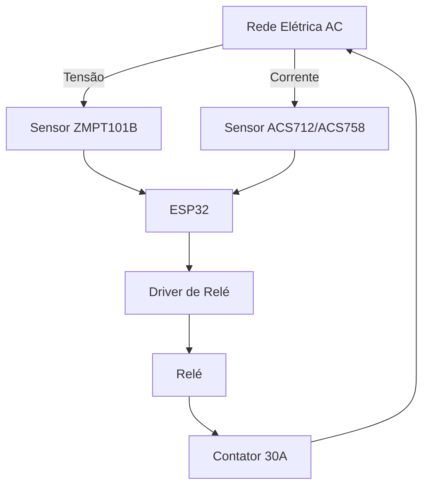
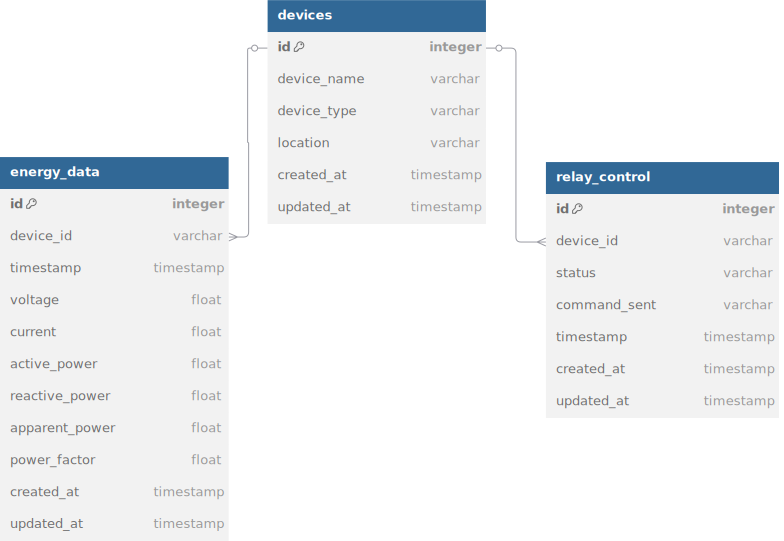

# Socket Inteligente com Filtro de Energia e Medição de Potência

Este projeto tem como objetivo desenvolver um socket inteligente que, além de ligar e desligar remotamente uma tomada por meio de um contator de 30A, realiza a medição da tensão e corrente da rede elétrica para calcular a potência ativa, reativa e aparente. A comunicação WiFi é implementada com um ESP32.

---

## Sumário

- [Objetivos](#objetivos)
- [Funcionalidades](#funcionalidades)
- [Componentes Necessários](#componentes-necessários)
- [Diagrama do Circuito](#diagrama-do-circuito)
- [Configuração do Firmware](#configuração-do-firmware)
- [Montagem e Testes](#montagem-e-testes)
- [Considerações de Segurança](#considerações-de-segurança)
- [Possíveis Melhorias](#possíveis-melhorias)
- [Licença](#licença)
- [Contribuição](#contribuição)
- [Contato](#contato)

---

## Objetivos

- **Medição de Energia:** Capturar sinais de tensão e corrente usando sensores dedicados.
- **Cálculo de Potência:** Determinar os valores de potência ativa, reativa e aparente a partir dos sinais medidos.
- **Controle Remoto:** Permitir o acionamento de um contator de 30A por meio de um relé controlado pelo ESP32, utilizando conexão WiFi.
- **Proteção e Isolamento:** Garantir a segurança dos circuitos de medição e controle com o uso de optoacopladores, divisores de tensão e outros dispositivos de proteção.

---

## Funcionalidades

- **Medição em Tempo Real:** Utilização de sensores para monitorar tensão (ex.: ZMPT101B) e corrente (ex.: ACS712/ACS758 ou transformador de corrente).
- **Cálculos de Potência:** 
  - **Potência Aparente (S):** \( S = V_{rms} \times I_{rms} \)
  - **Potência Ativa (P):** \( P = V_{rms} \times I_{rms} \times \cos(\phi) \)
  - **Potência Reativa (Q):** \( Q = V_{rms} \times I_{rms} \times \sin(\phi) \)
- **Controle de Carga:** Acionamento remoto do relé que ativa/desativa o contator.
- **Comunicação WiFi:** Monitoramento e controle do dispositivo por meio de protocolos como MQTT ou HTTP.
- **Isolamento e Proteção:** Circuitos de proteção para evitar interferências e garantir a segurança.

---

## Componentes Necessários

- **Microcontrolador:** ESP32 com WiFi integrado.
- **Sensor de Tensão:** Módulo ZMPT101B (ou similar).
- **Sensor de Corrente:** Módulo ACS712/ACS758 ou Transformador de Corrente (CT) com circuito de condicionamento.
- **Contator:** Dispositivo de 30A para controle da passagem de energia.
- **Relé:** Para acionar o contator.
- **Driver de Relé:** Caso o relé necessite de corrente ou tensão superior ao que o ESP32 pode fornecer.
- **Fonte AC-DC:** Para fornecer energia estável ao ESP32 e circuito de medição (3.3V ou 5V).
- **Componentes de Isolamento e Proteção:** Optoacopladores, divisores de tensão, filtros EMI, fusíveis, diodos de roda livre, etc.
- **Placa de Protótipos:** PCB ou perfboard para montagem do circuito.

---

## Diagrama do Circuito




Aqui está o diagrama de dados do seu sistema. Ele mostra a estrutura de como os dados serão armazenados e processados no backend:




--- 


## Processamento dos Dados

Os dados de medição de energia serão enviados do firmware do dispositivo (ESP32) para a API utilizando o protocolo HTTP. O backend será responsável por processar esses dados e calcular o consumo de energia, realizando as análises de potência ativa, reativa e aparente. 

A análise e processamento dos dados do payload serão feitos no backend em Python com **Django** e **Django REST Framework**. O backend se encarregará de realizar o cálculo de consumo, e os dados serão armazenados e manipulados conforme necessário.

### Exemplo de Payload Enviado pelo Firmware

Quando o firmware envia os dados para a API, o payload pode ser estruturado da seguinte maneira:

```json
{
  "device_id": "device_1234",
  "timestamp": "2025-03-24T14:30:00Z",
  "voltage": 230.5,
  "current": 5.2,
  "active_power": 1190.6,
  "reactive_power": 200.0,
  "apparent_power": 1225.6,
  "power_factor": 0.97
}
```

```json
{
  "device_id": "device_1234",
  "timestamp": "2025-03-24T14:30:00Z",
  "status": "turn_on",
  "command": 1,
}
```

Esse payload será recebido pela API, que realizará a análise dos dados e os armazenará em um banco de dados para posterior processamento e geração de relatórios.

---

## Configuração do Firmware

**Ambiente de Desenvolvimento**
- Utilize o Arduino IDE ou PlatformIO para programar o ESP32.

### Comunicação WiFi

- Configure a rede WiFi no ESP32.
- Implemente um protocolo de comunicação (MQTT, HTTP, ou servidor web) para envio e recebimento dos dados.

---

### Controle do Relé

O controle do relé é uma funcionalidade essencial para o funcionamento do sistema, permitindo que o contator de 30A seja acionado ou desligado remotamente. Através de um sistema de **uplink em tempo real**, você pode monitorar o status do relé (se está **ativo** ou **inativo**, ou seja, **ligado** ou **desligado**) a qualquer momento.

#### Uplink em Tempo Real

- **Monitoramento de Status:**  
  O firmware do dispositivo, por meio do ESP32, envia periodicamente o status atual do relé para o servidor (backend). Esse status pode ser enviado usando um protocolo como **MQTT** ou **HTTP**, atualizando o backend sobre o estado atual do relé (se ele está ligado ou desligado).  
  Isso permite que você saiba, em tempo real, se o relé está funcionando corretamente, sem a necessidade de estar fisicamente presente.

#### Dowlink via API

- **Comando de Controle Remoto (POST):**  
  A partir da sua API, você pode enviar um comando para o dispositivo, solicitando que ele ligue ou desligue o relé. Esse comando pode ser enviado através de uma requisição HTTP **POST** para um endpoint específico da sua API, que controlará o relé baseado no comando recebido.  
  Por exemplo:
  
  - **POST /api/relay/control**  
    **Payload:**  
    ```json
    {
      "device_id": "device_1234",
      "action": "turn_on"
    }
    ```
    Esse comando acionaria o relé, ligando o contator e permitindo a passagem de energia.

  - **POST /api/relay/control**  
    **Payload:**  
    ```json
    {
      "device_id": "device_1234",
      "action": "turn_off"
    }
    ```
    Esse comando desligaria o relé, interrompendo a passagem de energia.

#### Fluxo de Dados

1. **Uplink (Atualização do Status):**
   - O dispositivo (ESP32) envia o status atual do relé para o backend periodicamente ou sempre que houver alteração de estado (ligado/desligado).
   - A API armazena esse status, permitindo que o sistema ou o usuário final visualize em tempo real se o relé está ativo ou inativo.

2. **Dowlink (Controle Remoto):**
   - A API recebe o comando para ligar ou desligar o relé.
   - Através de uma requisição **POST**, o comando é transmitido para o dispositivo (ESP32), que então aciona o relé para realizar a ação solicitada (ligar/desligar).

Esse sistema de controle remoto oferece flexibilidade e comodidade, permitindo que você controle a passagem de energia de qualquer lugar e monitore a qualquer momento o estado do seu sistema de forma eficaz e em tempo real.


### Montagem e Testes

#### Montagem do Circuito

- Siga o diagrama para conectar todos os componentes.
- Garanta o isolamento adequado entre os circuitos de alta e baixa tensão.

#### Calibração dos Sensores

- Compare as medições com um multímetro ou medidor de energia.
- Ajuste os coeficientes de conversão no firmware.

#### Testes de Segurança

- Verifique todos os sistemas de proteção (fusíveis, optoacopladores, etc.) antes de ligar o circuito.
- Teste o acionamento do relé e o comportamento do contator.

#### Validação

- Simule condições de carga para validar os cálculos de potência.
- Utilize equipamentos como osciloscópio ou multímetro para confirmar a precisão das medições.

---

### Considerações de Segurança

- **Alta Tensão:** Trabalhe com extrema cautela, utilize equipamentos de proteção e, se necessário, consulte um profissional.
- **Isolamento:** Certifique-se de que os circuitos de medição estejam isolados dos circuitos de alta tensão.
- **Proteções Adicionais:** Utilize fusíveis, barreiras de isolamento e outros dispositivos de proteção para evitar danos e riscos.

---

### Integrações

- **Interface Web/Mobile:** Desenvolvimento de uma aplicação para monitoramento e controle remoto.
- **Análise Avançada:** Implementação de algoritmos para detecção de anomalias e otimização do consumo.
- **Integração IoT:** Conectar o dispositivo ao seu backend  para armazenamento e análise dos dados.

---

### Licença

Este projeto está licenciado sob a [MIT License](LICENSE).


 

